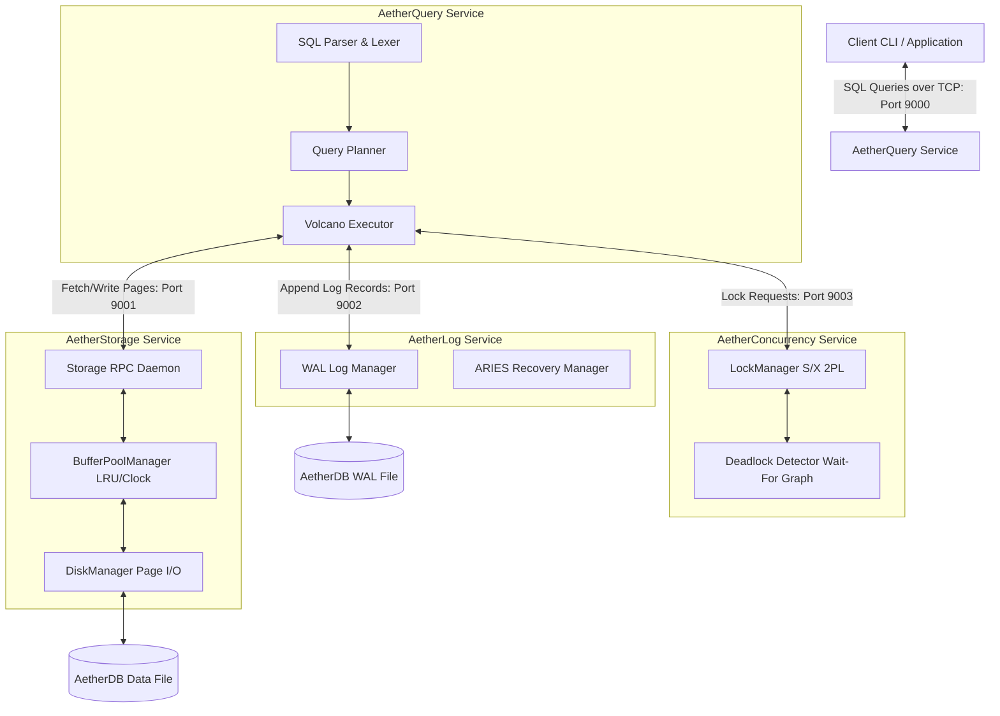

# AetherDB — Microservice-Based Relational Database Engine

AetherDB is a relational database management system (RDBMS) designed from first principles and structured as a microservice architecture. By decoupling storage, concurrency control, logging, and query execution into separate services communicating over TCP, AetherDB makes the internals of a database engine highly modular, visible, and educational.

---

## 1. System Architecture Diagram

The diagram below illustrates the relationship between the different services and components of AetherDB.



---

## 2. Component Directory Structure

The repository is organized as follows:

```
AetherDB/
├── CMakeLists.txt              # Root CMake build configuration
├── README.md                   # Project description and quickstart
├── system_design/              # System Design Documentation
│   └── system_architecture.md  # This document
├── common/                     # Common utilities, serialization, and socket library
│   ├── include/
│   │   └── common/
│   │       ├── types.hpp       # Core type definitions (page_id_t, lsn_t, txn_id_t)
│   │       ├── protocol.hpp    # Binary wire format protocol definitions
│   │       ├── socket.hpp      # Cross-platform socket wrapper for Winsock / POSIX
│   │       └── logger.hpp      # Logging wrappers around spdlog
│   └── src/
│       ├── socket.cpp
│       └── logger.cpp
├── services/                   # Microservices implementation
│   ├── storage/                # AetherStorage Service
│   │   ├── include/
│   │   │   └── storage/
│   │   │       ├── disk_manager.hpp
│   │   │       ├── buffer_pool_manager.hpp
│   │   │       └── storage_service.hpp
│   │   ├── src/
│   │   │       ├── disk_manager.cpp
│   │   │       ├── buffer_pool_manager.cpp
│   │   │       └── storage_service.cpp
│   │   └── main.cpp            # AetherStorage Daemon entry point
│   ├── log/                    # AetherLog Service
│   ├── concurrency/            # AetherConcurrency Service
│   └── query/                  # AetherQuery Service
└── tests/                      # Unit and integration tests
    ├── storage/
    └── ...
```

---

## 3. Microservice Interaction Flows

### A. Read Operation (SELECT)
1. **Client** sends `SELECT * FROM users WHERE id = 5` to the **AetherQuery Service** (port 9000).
2. **AetherQuery Service** parses the query, plans the execution, and executes it:
   - Identifies the Record ID (`RID` consisting of `page_id` and `slot_num`) using the B+ Tree index.
   - Requests a **Shared (S) Lock** on `RID` from the **AetherConcurrency Service** (port 9003).
   - Once lock is granted, sends `FetchPage(page_id)` request to the **AetherStorage Service** (port 9001).
   - **AetherStorage Service** checks the Buffer Pool, fetches the page from disk if necessary, pins it, and returns the page bytes.
   - **AetherQuery Service** extracts the record data, formats it, and returns it to the client.
   - At the end of the transaction, **AetherQuery Service** releases the lock.

### B. Write Operation (INSERT/UPDATE)
1. **Client** sends `UPDATE users SET age = 21 WHERE id = 5` to the **AetherQuery Service**.
2. **AetherQuery Service**:
   - Requests an **Exclusive (X) Lock** on `RID` from the **AetherConcurrency Service**.
   - Generates an `UPDATE` Log Record containing the transaction ID, `RID`, before-image (old age = 20), and after-image (new age = 21).
   - Appends the Log Record to the **AetherLog Service** (port 9002), which returns a Log Sequence Number (`LSN`).
   - Modifies the local in-memory representation of the page and writes it to the **AetherStorage Service**, passing the new page LSN.
   - **AetherStorage Service** updates the page in its buffer pool and marks it as dirty.
3. During **Commit**:
   - **AetherQuery Service** sends a `COMMIT` Log Record to the **AetherLog Service**.
   - **AetherLog Service** forces a flush of its WAL file to disk up to the `COMMIT` LSN.
   - **AetherQuery Service** releases all locks from the **AetherConcurrency Service**.
   - **AetherQuery Service** sends a success confirmation to the client.

### C. Write-Ahead Logging (WAL) Constraint
To guarantee durability and atomicity:
- The **AetherStorage Service** must never flush a dirty page to disk until the **AetherLog Service** has flushed the log file up to the page's LSN.
- This is coordinated by letting **AetherStorage** query the **AetherLog Service** for the currently flushed LSN (`GetFlushedLSN`) before writing a page to the database file. If the page's LSN is greater than the flushed LSN, it triggers a log flush first.
